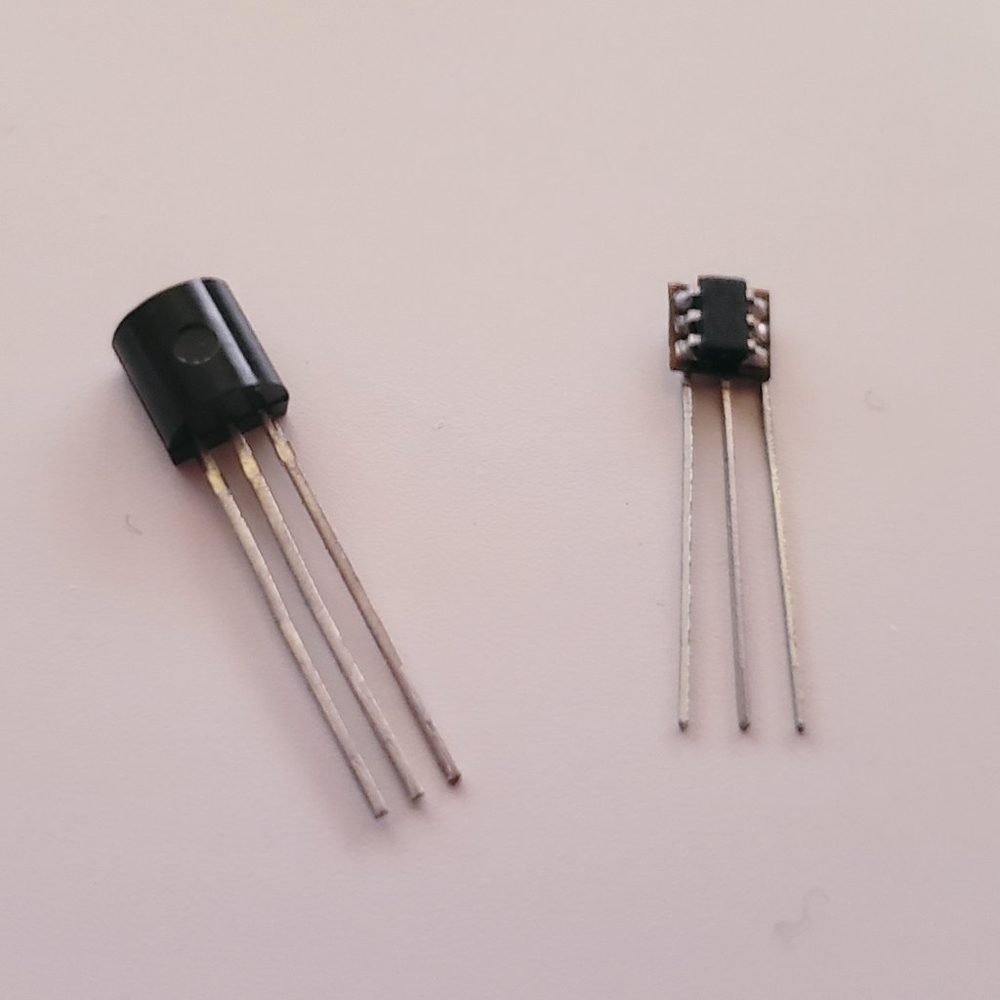
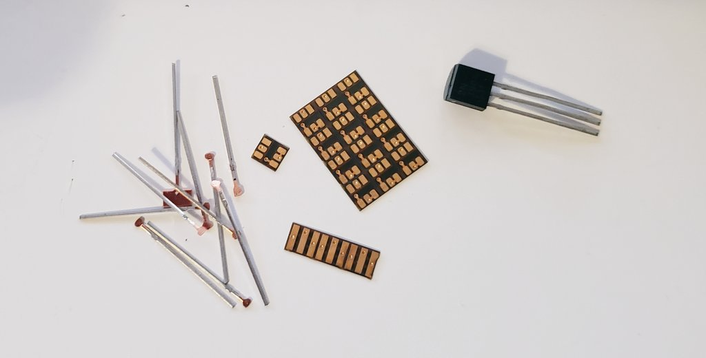
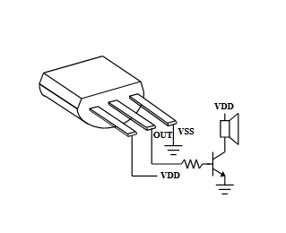

# "Doorbell"

I recently got an [M581A IC](http://tn.mosdesign.com.tw/Products/Spec/Melody/M581B.pdf) from Mosdesign Semiconductor (now sold as the M581B from Tungnan Technology). When you power it up, [it makes a doorbell chime, then turns itself off](https://twitter.com/DHammarskjold/status/1499219818058174470). That's all it does! It inspired me to make my own TO-92 tunes (preserving the TO-92 form factor is important because I think it's funny).

Some more detail and videos of the chips in action can be found [in this twitter thread](https://twitter.com/DHammarskjold/status/1505784073154797572).

The plan now is to make tiny TO-92 shape silicone moulds and embed the chips in resin.

## Repo contents

In the `circuit` folder is a KiCad 5 project, `oh-no-doorbell`. It includes a 3.4mm×3.6mm PCB that holds the ATtiny and the TO-92 legs in place. There is also a pre-panelized version which I had made at OSH Park.

In the `code` folder is a pair of avr-gcc files called `main.cpp` and `goose.cpp`. Building `main.cpp` lets you play the chorus of "Never Gonna Give You Up" (which you can hear [here](https://twitter.com/DHammarskjold/status/1506077126126043139); apologies to [anyone who went to Cornell in 2017 and is getting flashbacks](https://cornellsun.com/2017/11/10/hundreds-rickrolled-in-mysterious-campus-prank-at-cornell/)), or TMBG's "Theme from Flood" (which you can hear [here](https://twitter.com/DHammarskjold/status/1507946209494769665)). Building `goose.cpp` plays a honk sound effect from [Untitled Goose Game](https://goose.game/).

## Misc

What do I name this thing? How do I make a datasheet for it?

"Never Gonna Give You Up" fits on an ATtiny4/5. "Theme From Flood" and the honk sound byte require an ATtiny9 or 10.

If anyone has ideas for making a convincing [THX Deep Note](https://en.wikipedia.org/wiki/Deep_Note) on an ATtiny9/10, drop me a line.

The above diagram shows how to connect the IC to a speaker. It's taken from [the M581A datasheet](http://tn.mosdesign.com.tw/Products/Spec/Melody/M581B.pdf) but the pinout is the same for this device.

If you have a SOT-23 B-E-C BJT, or a SOT-23 G-S-D MOSFET, the same flex PCB can be used to turn them into E-B-C BJT TO-92s, or S-G-D MOSFET TO-92s. I want to make colorful transistors, like [Lee Cyborg's alligator clips](http://leecyb.org/?p=373).